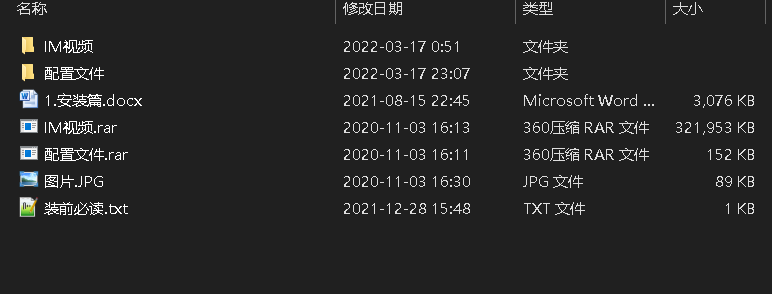
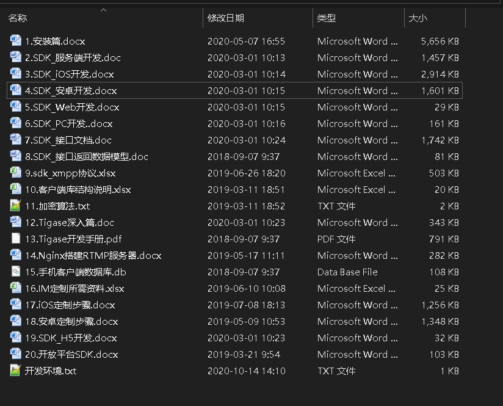
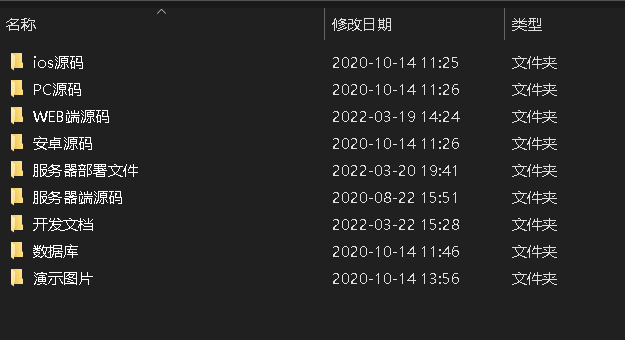
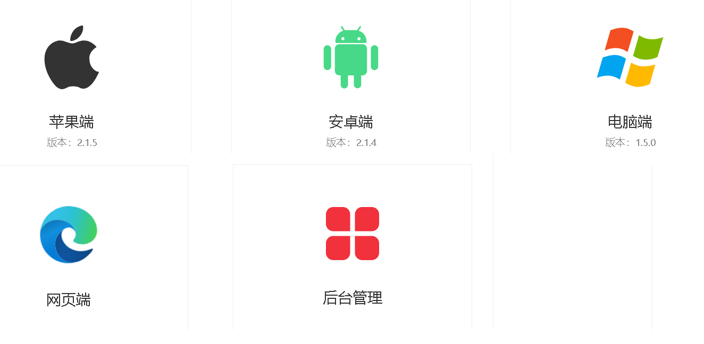
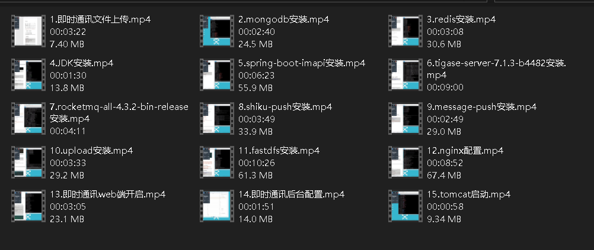
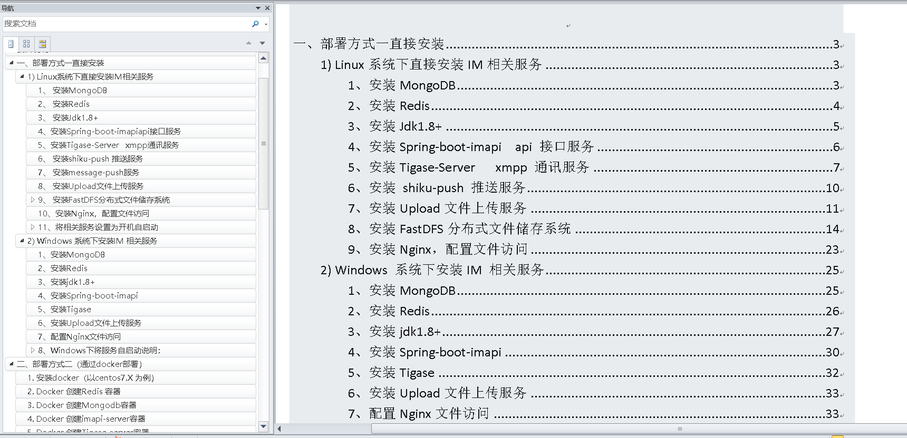
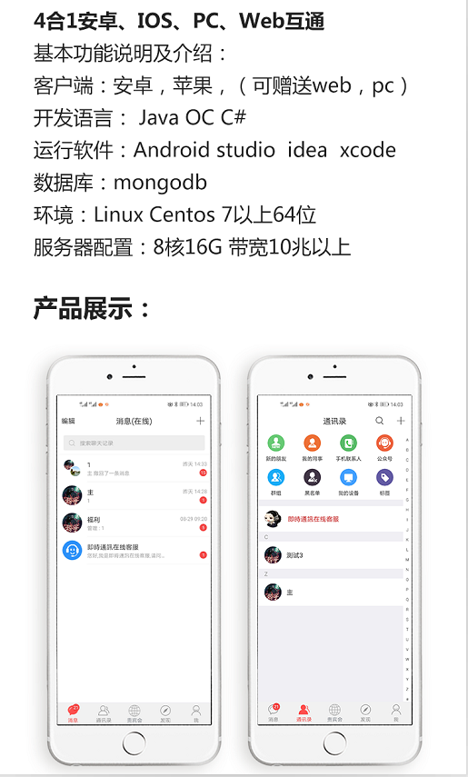
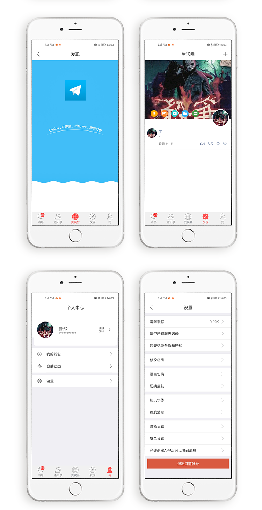
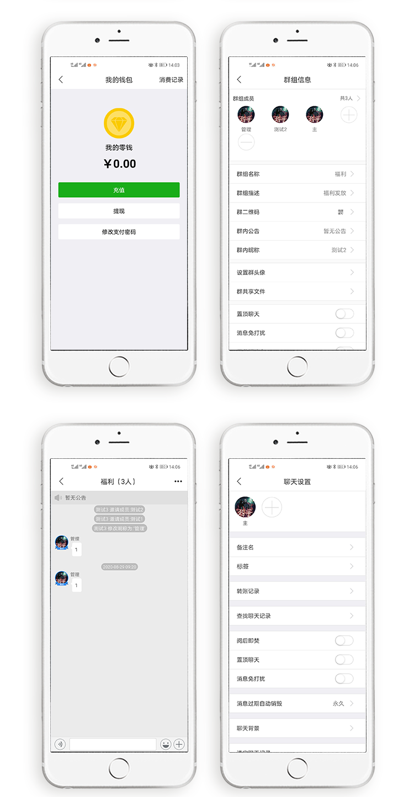
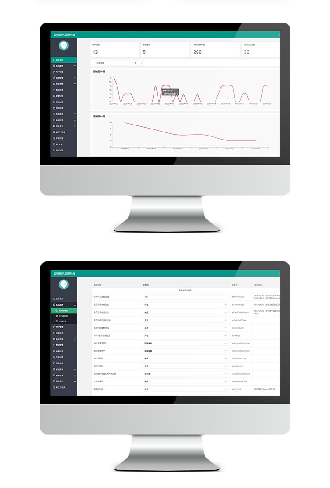

# 小盒即时通讯软件

<h1> 介绍</h1>

<h2>2021最新4合1即时通讯IM源码 服务端 PC WEB 安卓 IOS完整原生源码</h2>

<h1>xsbox-im 小盒即时通讯软件，客户端全套开源</h1>
<h5>
xsbox-im 小盒即时通讯软件，客户端全套开源,不加任何限制，可个人，可商业，可二次开发，随意使用
2021最新4合1即时通讯IM源码 服务端 PC WEB 安卓 IOS完整原生源码，视频安装教程，文档安装教程等等
</h5>
<h6>
注意：视频和文档在QQ群文档，欢迎进群讨论</h6>
 

#### xsbox-im说明

xsbox-im 是一套即时通讯的聊天系统，在这里献给大家，一方面希望能够帮助对即时通讯有兴趣研究的朋友，希望我们能够共同进步，另一个就是希望能够帮助到需要即时通讯系统的朋友或者企业，可以直接使用或者二次开发。可以用于公司内网、外网通讯、客服系统等，聊天系统。OIM项目可用于任何商业、个人作品中并且希望能够保留作者信息。如果xsbox-im能够帮助到您，请点赞好评，加个星。

一套完善的消息推送框架，可应用于信令推送，即时聊天，移动设备指令推送等领域。开发者可沉浸于业务开发，不用关心消息通道长连接、消息编解码协议等繁杂处理。

xsbox-im 采用业内主流开源技术构建，易于扩展和使用，并完美支持集群部署支持海量链接，目前支持websocket，android，ios，桌面应用，系统应用等多端接入持,可应用于移动应用，物联网，智能家居，嵌入式开发，桌面应用，WEB应用即时消服务

<h1>开源组件</h1>
<table>
<tr>
<td>组件</td>
<td>组件</td>
<td>完成</td>
</tr>

<tr>
<td>安卓端</td>
<td>android</td>
<td>✔已完成</td>
</tr>

<tr>
<td>苹果</td>
<td>ios</td>
<td>✔已完成</td>
</tr>

<tr>
<td>web端</td>
<td>JAVA，LAYIM</td>
<td>✔已完成</td>
</tr>

<tr>
<td>PC端</td>
<td>C#</td>
<td>✔已完成</td>
</tr>
</table>
 
<h1>客户端</h1>

<h1>软件功能</h1>

<section id="software-function"><h1 class="bilateral-line-title">软件功能</h1>
<table class="table text-center mb-0"><thead class="table-thead text-dark font-size-14 font-weight-bold"><tr><th rowspan="2" colspan="1" class="align-middle">功能模块</th><th rowspan="2" colspan="1" class="align-middle">功能名称</th><th rowspan="2" colspan="1" class="align-middle">功能介绍</th><th rowspan="1" colspan="4" class="align-middle">平台支持种类</th></tr><tr><th class="align-middle">安卓</th><th class="align-middle">IOS</th><th class="align-middle">WEB</th><th class="align-middle">MacOS Windows</th></tr></thead><tbody><tr><td class="align-middle" rowspan="29" colspan="1">通用功能</td><td class="align-middle" rowspan="1" colspan="1">长文本消息</td><td class="align-middle" rowspan="1" colspan="1">支持纯文字消息的发送，最长文本长度可达8K</td><td class="align-middle" rowspan="1" colspan="1">✔</td><td class="align-middle" rowspan="1" colspan="1">✔</td><td class="align-middle" rowspan="1" colspan="1">✔</td><td class="align-middle" rowspan="1" colspan="1">✔</td></tr><tr><td class="align-middle" rowspan="1" colspan="1">图片消息</td><td class="align-middle" rowspan="1" colspan="1">支持所有格式的图片消息的发送</td><td class="align-middle" rowspan="1" colspan="1">✔</td><td class="align-middle" rowspan="1" colspan="1">✔</td><td class="align-middle" rowspan="1" colspan="1">✔</td><td class="align-middle" rowspan="1" colspan="1">✔</td></tr><tr><td class="align-middle" rowspan="1" colspan="1">录音消息</td><td class="align-middle" rowspan="1" colspan="1">支持语音留言消息的发送</td><td class="align-middle" rowspan="1" colspan="1">✔</td><td class="align-middle" rowspan="1" colspan="1">✔</td><td class="align-middle" rowspan="1" colspan="1">✔</td><td class="align-middle" rowspan="1" colspan="1">✔</td></tr><tr><td class="align-middle" rowspan="1" colspan="1">录像消息</td><td class="align-middle" rowspan="1" colspan="1">支持已录制好的录像的发送</td><td class="align-middle" rowspan="1" colspan="1">✔</td><td class="align-middle" rowspan="1" colspan="1">✔</td><td class="align-middle" rowspan="1" colspan="1">✔</td><td class="align-middle" rowspan="1" colspan="1">✔</td></tr><tr><td class="align-middle" rowspan="1" colspan="1">名片消息</td><td class="align-middle" rowspan="1" colspan="1">支持个人名片类型的消息</td><td class="align-middle" rowspan="1" colspan="1">✔</td><td class="align-middle" rowspan="1" colspan="1">✔</td><td class="align-middle" rowspan="1" colspan="1">✔</td><td class="align-middle" rowspan="1" colspan="1">✔</td></tr><tr><td class="align-middle" rowspan="1" colspan="1">位置消息</td><td class="align-middle" rowspan="1" colspan="1">支持个人所在位置的消息，也可选择其他位置</td><td class="align-middle" rowspan="1" colspan="1">✔</td><td class="align-middle" rowspan="1" colspan="1">✔</td><td class="align-middle" rowspan="1" colspan="1">✔</td><td class="align-middle" rowspan="1" colspan="1">✔</td></tr><tr><td class="align-middle" rowspan="1" colspan="1">动画表情</td><td class="align-middle" rowspan="1" colspan="1">系统自身提供一些常用的动画表情</td><td class="align-middle" rowspan="1" colspan="1">✔</td><td class="align-middle" rowspan="1" colspan="1">✔</td><td class="align-middle" rowspan="1" colspan="1">✔</td><td class="align-middle" rowspan="1" colspan="1">✔</td></tr><tr><td class="align-middle" rowspan="1" colspan="1">文件消息</td><td class="align-middle" rowspan="1" colspan="1">支持发送文件类型的消息</td><td class="align-middle" rowspan="1" colspan="1">✔</td><td class="align-middle" rowspan="1" colspan="1">✔</td><td class="align-middle" rowspan="1" colspan="1">✔</td><td class="align-middle" rowspan="1" colspan="1">✔</td></tr><tr><td class="align-middle" rowspan="1" colspan="1">查看好友在线状态</td><td class="align-middle" rowspan="1" colspan="1">在聊天窗口顶部，可显示对方在线或离线</td><td class="align-middle" rowspan="1" colspan="1">✔</td><td class="align-middle" rowspan="1" colspan="1">✔</td><td class="align-middle" rowspan="1" colspan="1">✔</td><td class="align-middle" rowspan="1" colspan="1">✔</td></tr><tr><td class="align-middle" rowspan="1" colspan="1">默认表情</td><td class="align-middle" rowspan="1" colspan="1">系统自身提供一些默认表情及符号，精选常用的，非常精致</td><td class="align-middle" rowspan="1" colspan="1">✔</td><td class="align-middle" rowspan="1" colspan="1">✔</td><td class="align-middle" rowspan="1" colspan="1">✔</td><td class="align-middle" rowspan="1" colspan="1">✔</td></tr><tr><td class="align-middle" rowspan="1" colspan="1">黑名单功能</td><td class="align-middle" rowspan="1" colspan="1">可添加好友到黑名单，拒收一切消息</td><td class="align-middle" rowspan="1" colspan="1">✔</td><td class="align-middle" rowspan="1" colspan="1">✔</td><td class="align-middle" rowspan="1" colspan="1">✔</td><td class="align-middle" rowspan="1" colspan="1">✔</td></tr><tr><td class="align-middle" rowspan="1" colspan="1">自定义消息类型</td><td class="align-middle" rowspan="1" colspan="1">支持扩展XMPP协议类型，实现自定义的消息表现形式和功能</td><td class="align-middle" rowspan="1" colspan="1">✔</td><td class="align-middle" rowspan="1" colspan="1">✔</td><td class="align-middle" rowspan="1" colspan="1">✔</td><td class="align-middle" rowspan="1" colspan="1">✔</td></tr><tr><td class="align-middle" rowspan="1" colspan="1">消息送达状态</td><td class="align-middle" rowspan="1" colspan="1">支持显示聊天消息的送达状态，如：“送达”,“失败”</td><td class="align-middle" rowspan="1" colspan="1">✔</td><td class="align-middle" rowspan="1" colspan="1">✔</td><td class="align-middle" rowspan="1" colspan="1">✔</td><td class="align-middle" rowspan="1" colspan="1">✔</td></tr><tr><td class="align-middle" rowspan="1" colspan="1">消息阅读状态</td><td class="align-middle" rowspan="1" colspan="1">支持查看聊天对象的阅读状态查看，如：“未读”,“已读”</td><td class="align-middle" rowspan="1" colspan="1">✔</td><td class="align-middle" rowspan="1" colspan="1">✔</td><td class="align-middle" rowspan="1" colspan="1">✔</td><td class="align-middle" rowspan="1" colspan="1">✔</td></tr><tr><td class="align-middle" rowspan="1" colspan="1">消息重发</td><td class="align-middle" rowspan="1" colspan="1">当网络环境不正常，消息未发送出去时，支持消息重发功能</td><td class="align-middle" rowspan="1" colspan="1">✔</td><td class="align-middle" rowspan="1" colspan="1">✔</td><td class="align-middle" rowspan="1" colspan="1">✔</td><td class="align-middle" rowspan="1" colspan="1">✔</td></tr><tr><td class="align-middle" rowspan="1" colspan="1">撤回消息</td><td class="align-middle" rowspan="1" colspan="1">在单聊和群聊时，发送者或群主可随时撤回消息</td><td class="align-middle" rowspan="1" colspan="1">✔</td><td class="align-middle" rowspan="1" colspan="1">✔</td><td class="align-middle" rowspan="1" colspan="1">✔</td><td class="align-middle" rowspan="1" colspan="1">✔</td></tr><tr><td class="align-middle" rowspan="1" colspan="1">加密通讯</td><td class="align-middle" rowspan="1" colspan="1">可使用加密协议方式发送任何消息，全局设置</td><td class="align-middle" rowspan="1" colspan="1">✔</td><td class="align-middle" rowspan="1" colspan="1">✔</td><td class="align-middle" rowspan="1" colspan="1">✔</td><td class="align-middle" rowspan="1" colspan="1">✔</td></tr><tr><td class="align-middle" rowspan="1" colspan="1">新消息数量提醒</td><td class="align-middle" rowspan="1" colspan="1">收到新消息，在红圆内显示未读数量提醒用户</td><td class="align-middle" rowspan="1" colspan="1">✔</td><td class="align-middle" rowspan="1" colspan="1">✔</td><td class="align-middle" rowspan="1" colspan="1">✔</td><td class="align-middle" rowspan="1" colspan="1">✔</td></tr><tr><td class="align-middle" rowspan="1" colspan="1">多点登录和消息同步</td><td class="align-middle" rowspan="1" colspan="1">支持同账户下的各个平台的消息接收（如PC、IOS、安卓）,各个平台可同时登录</td><td class="align-middle" rowspan="1" colspan="1">✔</td><td class="align-middle" rowspan="1" colspan="1">✔</td><td class="align-middle" rowspan="1" colspan="1">✔</td><td class="align-middle" rowspan="1" colspan="1">✖</td></tr><tr><td class="align-middle" rowspan="1" colspan="1">过期自动销毁</td><td class="align-middle" rowspan="1" colspan="1">每个好友可设置过期时间，到期自动删除各设备端和服务器端的聊天记录和文件</td><td class="align-middle" rowspan="1" colspan="1">✔</td><td class="align-middle" rowspan="1" colspan="1">✔</td><td class="align-middle" rowspan="1" colspan="1">✔</td><td class="align-middle" rowspan="1" colspan="1">✖</td></tr><tr><td class="align-middle" rowspan="1" colspan="1">漫游消息同步</td><td class="align-middle" rowspan="1" colspan="1">支持非本地存储消息历史内容的接收和查看</td><td class="align-middle" rowspan="1" colspan="1">✔</td><td class="align-middle" rowspan="1" colspan="1">✔</td><td class="align-middle" rowspan="1" colspan="1">✔</td><td class="align-middle" rowspan="1" colspan="1">✖</td></tr><tr><td class="align-middle" rowspan="1" colspan="1">消息转发</td><td class="align-middle" rowspan="1" colspan="1">支持手机端转发其他用户传输的消息,支持合并转发和逐条转发</td><td class="align-middle" rowspan="1" colspan="1">✔</td><td class="align-middle" rowspan="1" colspan="1">✔</td><td class="align-middle" rowspan="1" colspan="1">✔</td><td class="align-middle" rowspan="1" colspan="1">✖</td></tr><tr><td class="align-middle" rowspan="1" colspan="1">接收离线消息并提醒</td><td class="align-middle" rowspan="1" colspan="1">支持接收离线消息，APP关闭或离线时，仍能收到系统级的通知</td><td class="align-middle" rowspan="1" colspan="1">✔</td><td class="align-middle" rowspan="1" colspan="1">✔</td><td class="align-middle" rowspan="1" colspan="1">✔</td><td class="align-middle" rowspan="1" colspan="1">✖</td></tr><tr><td class="align-middle" rowspan="1" colspan="1">阅后即焚</td><td class="align-middle" rowspan="1" colspan="1">敏感内容可用阅后即焚方式发送，支持文字图片录音录像等类型</td><td class="align-middle" rowspan="1" colspan="1">✔</td><td class="align-middle" rowspan="1" colspan="1">✔</td><td class="align-middle" rowspan="1" colspan="1">✔</td><td class="align-middle" rowspan="1" colspan="1">✖</td></tr><tr><td class="align-middle" rowspan="1" colspan="1">红包消息</td><td class="align-middle" rowspan="1" colspan="1">支持发送随机红包、平分红包、口令红包</td><td class="align-middle" rowspan="1" colspan="1">✔</td><td class="align-middle" rowspan="1" colspan="1">✔</td><td class="align-middle" rowspan="1" colspan="1">✔</td><td class="align-middle" rowspan="1" colspan="1">✖</td></tr><tr><td class="align-middle" rowspan="1" colspan="1">聊天记录搜索</td><td class="align-middle" rowspan="1" colspan="1">支持按关键字搜索聊天记录</td><td class="align-middle" rowspan="1" colspan="1">✔</td><td class="align-middle" rowspan="1" colspan="1">✔</td><td class="align-middle" rowspan="1" colspan="1">✖</td><td class="align-middle" rowspan="1" colspan="1">✔</td></tr><tr><td class="align-middle" rowspan="1" colspan="1">自定义表情</td><td class="align-middle" rowspan="1" colspan="1">聊天时可收藏图片，成为表情</td><td class="align-middle" rowspan="1" colspan="1">✔</td><td class="align-middle" rowspan="1" colspan="1">✔</td><td class="align-middle" rowspan="1" colspan="1">✖</td><td class="align-middle" rowspan="1" colspan="1">✖</td></tr><tr><td class="align-middle" rowspan="1" colspan="1">快速发送截图</td><td class="align-middle" rowspan="1" colspan="1">如最近截了图，在发送消息时会直接显示此图的缩略图，点击可直接发送</td><td class="align-middle" rowspan="1" colspan="1">✔</td><td class="align-middle" rowspan="1" colspan="1">✔</td><td class="align-middle" rowspan="1" colspan="1">✖</td><td class="align-middle" rowspan="1" colspan="1">✖</td></tr><tr><td class="align-middle" rowspan="1" colspan="1">聊天个性显示</td><td class="align-middle" rowspan="1" colspan="1">可设置聊天字体大小，并为每个好友设置不同的聊天背景</td><td class="align-middle" rowspan="1" colspan="1">✔</td><td class="align-middle" rowspan="1" colspan="1">✔</td><td class="align-middle" rowspan="1" colspan="1">✖</td><td class="align-middle" rowspan="1" colspan="1">✖</td></tr><tr><td class="align-middle" rowspan="8" colspan="1">单聊</td><td class="align-middle" rowspan="1" colspan="1">新朋友验证</td><td class="align-middle" rowspan="1" colspan="1">在个人隐私设置里，可设置被加好友时，需不需要验证</td><td class="align-middle" rowspan="1" colspan="1">✔</td><td class="align-middle" rowspan="1" colspan="1">✔</td><td class="align-middle" rowspan="1" colspan="1">✔</td><td class="align-middle" rowspan="1" colspan="1">✔</td></tr><tr><td class="align-middle" rowspan="1" colspan="1">个人资料以及头像显示</td><td class="align-middle" rowspan="1" colspan="1">提供个人资料查看修改功能、支持头像自主上传与显示</td><td class="align-middle" rowspan="1" colspan="1">✔</td><td class="align-middle" rowspan="1" colspan="1">✔</td><td class="align-middle" rowspan="1" colspan="1">✔</td><td class="align-middle" rowspan="1" colspan="1">✔</td></tr><tr><td class="align-middle" rowspan="1" colspan="1">实时视频/语音通话</td><td class="align-middle" rowspan="1" colspan="1">支持双方视频或语音通话功能</td><td class="align-middle" rowspan="1" colspan="1">✔</td><td class="align-middle" rowspan="1" colspan="1">✔</td><td class="align-middle" rowspan="1" colspan="1">✔</td><td class="align-middle" rowspan="1" colspan="1">✔</td></tr><tr><td class="align-middle" rowspan="1" colspan="1">我的同事</td><td class="align-middle" rowspan="1" colspan="1">以树的形式显示本公司所有部门所有员工，并有管理功能</td><td class="align-middle" rowspan="1" colspan="1">✔</td><td class="align-middle" rowspan="1" colspan="1">✔</td><td class="align-middle" rowspan="1" colspan="1">✔</td><td class="align-middle" rowspan="1" colspan="1">✖</td></tr><tr><td class="align-middle" rowspan="1" colspan="1">标签分组</td><td class="align-middle" rowspan="1" colspan="1">一个好友可以加上多个标签，一个标签下可以有多个好友，方便管理</td><td class="align-middle" rowspan="1" colspan="1">✔</td><td class="align-middle" rowspan="1" colspan="1">✔</td><td class="align-middle" rowspan="1" colspan="1">✖</td><td class="align-middle" rowspan="1" colspan="1">✖</td></tr><tr><td class="align-middle" rowspan="1" colspan="1">扫描二维码加好友</td><td class="align-middle" rowspan="1" colspan="1">打开个人详情的二维码，可直接扫描加为好友</td><td class="align-middle" rowspan="1" colspan="1">✔</td><td class="align-middle" rowspan="1" colspan="1">✔</td><td class="align-middle" rowspan="1" colspan="1">✖</td><td class="align-middle" rowspan="1" colspan="1">✖</td></tr><tr><td class="align-middle" rowspan="1" colspan="1">消息免打扰</td><td class="align-middle" rowspan="1" colspan="1">支持有新消息时，关掉系统通知、震动、声音</td><td class="align-middle" rowspan="1" colspan="1">✔</td><td class="align-middle" rowspan="1" colspan="1">✔</td><td class="align-middle" rowspan="1" colspan="1">✖</td><td class="align-middle" rowspan="1" colspan="1">✖</td></tr><tr><td class="align-middle" rowspan="1" colspan="1">清空本地聊天记录</td><td class="align-middle" rowspan="1" colspan="1">支持手机端持清空本地的聊天记录</td><td class="align-middle" rowspan="1" colspan="1">✔</td><td class="align-middle" rowspan="1" colspan="1">✔</td><td class="align-middle" rowspan="1" colspan="1">✖</td><td class="align-middle" rowspan="1" colspan="1">✖</td></tr><tr><td class="align-middle" rowspan="20" colspan="1">群组聊天</td><td class="align-middle" rowspan="1" colspan="1">支持群组沟通</td><td class="align-middle" rowspan="1" colspan="1">支持群组即时沟通，群发文件、通知公告等</td><td class="align-middle" rowspan="1" colspan="1">✔</td><td class="align-middle" rowspan="1" colspan="1">✔</td><td class="align-middle" rowspan="1" colspan="1">✔</td><td class="align-middle" rowspan="1" colspan="1">✔</td></tr><tr><td class="align-middle" rowspan="1" colspan="1">创建群组</td><td class="align-middle" rowspan="1" colspan="1">支持个人用户邀请好友创建群组功能</td><td class="align-middle" rowspan="1" colspan="1">✔</td><td class="align-middle" rowspan="1" colspan="1">✔</td><td class="align-middle" rowspan="1" colspan="1">✔</td><td class="align-middle" rowspan="1" colspan="1">✔</td></tr><tr><td class="align-middle" rowspan="1" colspan="1">群公告</td><td class="align-middle" rowspan="1" colspan="1">支持群公告查看、编辑（群管理员）、删除（群管理员）</td><td class="align-middle" rowspan="1" colspan="1">✔</td><td class="align-middle" rowspan="1" colspan="1">✔</td><td class="align-middle" rowspan="1" colspan="1">✔</td><td class="align-middle" rowspan="1" colspan="1">✔</td></tr><tr><td class="align-middle" rowspan="1" colspan="1">邀请群成员</td><td class="align-middle" rowspan="1" colspan="1">支持邀请群成员，被邀请的成员可以加入邀请的群中</td><td class="align-middle" rowspan="1" colspan="1">✔</td><td class="align-middle" rowspan="1" colspan="1">✔</td><td class="align-middle" rowspan="1" colspan="1">✔</td><td class="align-middle" rowspan="1" colspan="1">✔</td></tr><tr><td class="align-middle" rowspan="1" colspan="1">隐私群</td><td class="align-middle" rowspan="1" colspan="1">支持群组隐形、群成员隐形、群内成员无法私聊及加好友、不允许邀请人等</td><td class="align-middle" rowspan="1" colspan="1">✔</td><td class="align-middle" rowspan="1" colspan="1">✔</td><td class="align-middle" rowspan="1" colspan="1">✔</td><td class="align-middle" rowspan="1" colspan="1">✔</td></tr><tr><td class="align-middle" rowspan="1" colspan="1">设置管理员</td><td class="align-middle" rowspan="1" colspan="1">支持设置管理员功能、管理员有权限删除当前群成员</td><td class="align-middle" rowspan="1" colspan="1">✔</td><td class="align-middle" rowspan="1" colspan="1">✔</td><td class="align-middle" rowspan="1" colspan="1">✔</td><td class="align-middle" rowspan="1" colspan="1">✔</td></tr><tr><td class="align-middle" rowspan="1" colspan="1">删除群成员</td><td class="align-middle" rowspan="1" colspan="1">支持群主及管理员删除当前群成员</td><td class="align-middle" rowspan="1" colspan="1">✔</td><td class="align-middle" rowspan="1" colspan="1">✔</td><td class="align-middle" rowspan="1" colspan="1">✔</td><td class="align-middle" rowspan="1" colspan="1">✔</td></tr><tr><td class="align-middle" rowspan="1" colspan="1">退出/解散群组</td><td class="align-middle" rowspan="1" colspan="1">支持个人群组的成员退出与个人群主的解散群组</td><td class="align-middle" rowspan="1" colspan="1">✔</td><td class="align-middle" rowspan="1" colspan="1">✔</td><td class="align-middle" rowspan="1" colspan="1">✔</td><td class="align-middle" rowspan="1" colspan="1">✔</td></tr><tr><td class="align-middle" rowspan="1" colspan="1">群成员列表和搜索</td><td class="align-middle" rowspan="1" colspan="1">支持所有群成员的搜索功能，查看群成员的相关信息，如姓名、联系方式等</td><td class="align-middle" rowspan="1" colspan="1">✔</td><td class="align-middle" rowspan="1" colspan="1">✔</td><td class="align-middle" rowspan="1" colspan="1">✔</td><td class="align-middle" rowspan="1" colspan="1">✔</td></tr><tr><td class="align-middle" rowspan="1" colspan="1">语音会议</td><td class="align-middle" rowspan="1" colspan="1">支持群组内多方语音通话功能，支持不同终端间互通</td><td class="align-middle" rowspan="1" colspan="1">✔</td><td class="align-middle" rowspan="1" colspan="1">✔</td><td class="align-middle" rowspan="1" colspan="1">✔</td><td class="align-middle" rowspan="1" colspan="1">✔</td></tr><tr><td class="align-middle" rowspan="1" colspan="1">视频会议</td><td class="align-middle" rowspan="1" colspan="1">支持群组内多方视频通话功能，支持不同终端间互通</td><td class="align-middle" rowspan="1" colspan="1">✔</td><td class="align-middle" rowspan="1" colspan="1">✔</td><td class="align-middle" rowspan="1" colspan="1">✔</td><td class="align-middle" rowspan="1" colspan="1">✔</td></tr><tr><td class="align-middle" rowspan="1" colspan="1">@群成员</td><td class="align-middle" rowspan="1" colspan="1">支持@群成员功能，被@的群成员消息提醒的功能</td><td class="align-middle" rowspan="1" colspan="1">✔</td><td class="align-middle" rowspan="1" colspan="1">✔</td><td class="align-middle" rowspan="1" colspan="1">✔</td><td class="align-middle" rowspan="1" colspan="1">✖</td></tr><tr><td class="align-middle" rowspan="1" colspan="1">群共享</td><td class="align-middle" rowspan="1" colspan="1">支持群内文件共享功能</td><td class="align-middle" rowspan="1" colspan="1">✔</td><td class="align-middle" rowspan="1" colspan="1">✔</td><td class="align-middle" rowspan="1" colspan="1">✔</td><td class="align-middle" rowspan="1" colspan="1">✖</td></tr><tr><td class="align-middle" rowspan="1" colspan="1">群消息设置</td><td class="align-middle" rowspan="1" colspan="1">支持群消息设置，屏蔽/接收群消息</td><td class="align-middle" rowspan="1" colspan="1">✔</td><td class="align-middle" rowspan="1" colspan="1">✔</td><td class="align-middle" rowspan="1" colspan="1">✔</td><td class="align-middle" rowspan="1" colspan="1">✖</td></tr><tr><td class="align-middle" rowspan="1" colspan="1">修改群名片</td><td class="align-middle" rowspan="1" colspan="1">支持群成员个人的群名片修改</td><td class="align-middle" rowspan="1" colspan="1">✔</td><td class="align-middle" rowspan="1" colspan="1">✔</td><td class="align-middle" rowspan="1" colspan="1">✔</td><td class="align-middle" rowspan="1" colspan="1">✖</td></tr><tr><td class="align-middle" rowspan="1" colspan="1">消息免打扰</td><td class="align-middle" rowspan="1" colspan="1">支持有新的群组消息时，关掉系统通知、震动、声音</td><td class="align-middle" rowspan="1" colspan="1">✔</td><td class="align-middle" rowspan="1" colspan="1">✔</td><td class="align-middle" rowspan="1" colspan="1">✔</td><td class="align-middle" rowspan="1" colspan="1">✖</td></tr><tr><td class="align-middle" rowspan="1" colspan="1">消息阅读状态</td><td class="align-middle" rowspan="1" colspan="1">支持显示几人阅读过本消息，并显示阅读人员清单</td><td class="align-middle" rowspan="1" colspan="1">✔</td><td class="align-middle" rowspan="1" colspan="1">✔</td><td class="align-middle" rowspan="1" colspan="1">✔</td><td class="align-middle" rowspan="1" colspan="1">✖</td></tr><tr><td class="align-middle" rowspan="1" colspan="1">显示群头像</td><td class="align-middle" rowspan="1" colspan="1">根据群成员自动显示群头像，最多显示5个群成员</td><td class="align-middle" rowspan="1" colspan="1">✔</td><td class="align-middle" rowspan="1" colspan="1">✔</td><td class="align-middle" rowspan="1" colspan="1">✖</td><td class="align-middle" rowspan="1" colspan="1">✖</td></tr><tr><td class="align-middle" rowspan="1" colspan="1">扫描二维码加群</td><td class="align-middle" rowspan="1" colspan="1">打开群组详情的二维码，可直接扫描进入群组</td><td class="align-middle" rowspan="1" colspan="1">✔</td><td class="align-middle" rowspan="1" colspan="1">✔</td><td class="align-middle" rowspan="1" colspan="1">✖</td><td class="align-middle" rowspan="1" colspan="1">✖</td></tr><tr><td class="align-middle" rowspan="1" colspan="1">入群验证</td><td class="align-middle" rowspan="1" colspan="1">支持群组可选是否验证入群，加群后，管理员收到信息决定是否放入</td><td class="align-middle" rowspan="1" colspan="1">✔</td><td class="align-middle" rowspan="1" colspan="1">✔</td><td class="align-middle" rowspan="1" colspan="1">✖</td><td class="align-middle" rowspan="1" colspan="1">✖</td></tr><tr><td class="align-middle" rowspan="8" colspan="1">朋友圈</td><td class="align-middle" rowspan="1" colspan="1">发布朋友圈</td><td class="align-middle" rowspan="1" colspan="1">支持发布纯文字/图片/语音/视频等各种形式</td><td class="align-middle" rowspan="1" colspan="1">✔</td><td class="align-middle" rowspan="1" colspan="1">✔</td><td class="align-middle" rowspan="1" colspan="1">✖</td><td class="align-middle" rowspan="1" colspan="1">✖</td></tr><tr><td class="align-middle" rowspan="1" colspan="1">定向发布</td><td class="align-middle" rowspan="1" colspan="1">可选择四种方式：公开、私密、部分好友可见、不给谁看</td><td class="align-middle" rowspan="1" colspan="1">✔</td><td class="align-middle" rowspan="1" colspan="1">✔</td><td class="align-middle" rowspan="1" colspan="1">✖</td><td class="align-middle" rowspan="1" colspan="1">✖</td></tr><tr><td class="align-middle" rowspan="1" colspan="1">定向提醒</td><td class="align-middle" rowspan="1" colspan="1">支持提醒某些好友第一时间查看朋友圈</td><td class="align-middle" rowspan="1" colspan="1">✔</td><td class="align-middle" rowspan="1" colspan="1">✔</td><td class="align-middle" rowspan="1" colspan="1">✖</td><td class="align-middle" rowspan="1" colspan="1">✖</td></tr><tr><td class="align-middle" rowspan="1" colspan="1">浏览朋友圈</td><td class="align-middle" rowspan="1" colspan="1">支持以列表的方式浏览所关注的好友的朋友圈</td><td class="align-middle" rowspan="1" colspan="1">✔</td><td class="align-middle" rowspan="1" colspan="1">✔</td><td class="align-middle" rowspan="1" colspan="1">✖</td><td class="align-middle" rowspan="1" colspan="1">✖</td></tr><tr><td class="align-middle" rowspan="1" colspan="1">删除朋友圈</td><td class="align-middle" rowspan="1" colspan="1">支持删除朋友圈</td><td class="align-middle" rowspan="1" colspan="1">✔</td><td class="align-middle" rowspan="1" colspan="1">✔</td><td class="align-middle" rowspan="1" colspan="1">✖</td><td class="align-middle" rowspan="1" colspan="1">✖</td></tr><tr><td class="align-middle" rowspan="1" colspan="1">点赞和评论朋友圈</td><td class="align-middle" rowspan="1" colspan="1">支持对朋友圈点赞/取消点赞支持评论朋友圈、回复评论</td><td class="align-middle" rowspan="1" colspan="1">✔</td><td class="align-middle" rowspan="1" colspan="1">✔</td><td class="align-middle" rowspan="1" colspan="1">✖</td><td class="align-middle" rowspan="1" colspan="1">✖</td></tr><tr><td class="align-middle" rowspan="1" colspan="1">对点赞实时提醒</td><td class="align-middle" rowspan="1" colspan="1">支持点赞后，第一时间推送到朋友圈的相关人员那</td><td class="align-middle" rowspan="1" colspan="1">✔</td><td class="align-middle" rowspan="1" colspan="1">✔</td><td class="align-middle" rowspan="1" colspan="1">✖</td><td class="align-middle" rowspan="1" colspan="1">✖</td></tr><tr><td class="align-middle" rowspan="1" colspan="1">对评论实时提醒</td><td class="align-middle" rowspan="1" colspan="1">支持评论后，第一时间推送到朋友圈的相关人员那</td><td class="align-middle" rowspan="1" colspan="1">✔</td><td class="align-middle" rowspan="1" colspan="1">✔</td><td class="align-middle" rowspan="1" colspan="1">✖</td><td class="align-middle" rowspan="1" colspan="1">✖</td></tr><tr><td class="align-middle" rowspan="4" colspan="1">公众号</td><td class="align-middle" rowspan="1" colspan="1">后台网页管理</td><td class="align-middle" rowspan="1" colspan="1">有登录、群发消息、群发图文消息、自定义菜单、粉丝管理等</td><td class="align-middle" rowspan="1" colspan="1">✖</td><td class="align-middle" rowspan="1" colspan="1">✖</td><td class="align-middle" rowspan="1" colspan="1">✔</td><td class="align-middle" rowspan="1" colspan="1">✖</td></tr><tr><td class="align-middle" rowspan="1" colspan="1">前端显示自定义菜单</td><td class="align-middle" rowspan="1" colspan="1">根据公众号的设置，显示个性化的菜单</td><td class="align-middle" rowspan="1" colspan="1">✔</td><td class="align-middle" rowspan="1" colspan="1">✔</td><td class="align-middle" rowspan="1" colspan="1">✔</td><td class="align-middle" rowspan="1" colspan="1">✖</td></tr><tr><td class="align-middle" rowspan="1" colspan="1">前端接收公众号推送</td><td class="align-middle" rowspan="1" colspan="1">如微信一样能显示单条图文消息、多条图文消息、以及私信等</td><td class="align-middle" rowspan="1" colspan="1">✔</td><td class="align-middle" rowspan="1" colspan="1">✔</td><td class="align-middle" rowspan="1" colspan="1">✔</td><td class="align-middle" rowspan="1" colspan="1">✖</td></tr><tr><td class="align-middle" rowspan="1" colspan="1">在微信公众号内群聊</td><td class="align-middle" rowspan="1" colspan="1">多个用户同时打开微信公众号，访问视酷网页，即可进入聊天室群聊</td><td class="align-middle" rowspan="1" colspan="1">✔</td><td class="align-middle" rowspan="1" colspan="1">✔</td><td class="align-middle" rowspan="1" colspan="1">✔</td><td class="align-middle" rowspan="1" colspan="1">✖</td></tr><tr><td class="align-middle" rowspan="3" colspan="1">在线客服</td><td class="align-middle" rowspan="1" colspan="1">接入组件</td><td class="align-middle" rowspan="1" colspan="1">客户可以从web、微信等发起在线会话</td><td class="align-middle" rowspan="1" colspan="1">✔</td><td class="align-middle" rowspan="1" colspan="1">✔</td><td class="align-middle" rowspan="1" colspan="1">✔</td><td class="align-middle" rowspan="1" colspan="1">✖</td></tr><tr><td class="align-middle" rowspan="1" colspan="1">对话分配</td><td class="align-middle" rowspan="1" colspan="1">根据客服同时服务人数分配空闲的客服</td><td class="align-middle" rowspan="1" colspan="1">✔</td><td class="align-middle" rowspan="1" colspan="1">✔</td><td class="align-middle" rowspan="1" colspan="1">✔</td><td class="align-middle" rowspan="1" colspan="1">✖</td></tr><tr><td class="align-middle" rowspan="1" colspan="1">对话转接</td><td class="align-middle" rowspan="1" colspan="1">实现客服与客服之间的转移，聊天记录也转移</td><td class="align-middle" rowspan="1" colspan="1">✔</td><td class="align-middle" rowspan="1" colspan="1">✔</td><td class="align-middle" rowspan="1" colspan="1">✔</td><td class="align-middle" rowspan="1" colspan="1">✖</td></tr><tr><td class="align-middle" rowspan="10" colspan="1">直播</td><td class="align-middle" rowspan="1" colspan="1">一对多实时视频</td><td class="align-middle" rowspan="1" colspan="1">主播对多名观众进行直播，延时在1—3秒之间</td><td class="align-middle" rowspan="1" colspan="1">✔</td><td class="align-middle" rowspan="1" colspan="1">✔</td><td class="align-middle" rowspan="1" colspan="1">✖</td><td class="align-middle" rowspan="1" colspan="1">✖</td></tr><tr><td class="align-middle" rowspan="1" colspan="1">挂断/恢复</td><td class="align-middle" rowspan="1" colspan="1">可暂时中止直播，随时恢复，不必重建直播间</td><td class="align-middle" rowspan="1" colspan="1">✔</td><td class="align-middle" rowspan="1" colspan="1">✔</td><td class="align-middle" rowspan="1" colspan="1">✖</td><td class="align-middle" rowspan="1" colspan="1">✖</td></tr><tr><td class="align-middle" rowspan="1" colspan="1">文字聊天</td><td class="align-middle" rowspan="1" colspan="1">可直播间内以文字的方式进行群聊，互动</td><td class="align-middle" rowspan="1" colspan="1">✔</td><td class="align-middle" rowspan="1" colspan="1">✔</td><td class="align-middle" rowspan="1" colspan="1">✖</td><td class="align-middle" rowspan="1" colspan="1">✖</td></tr><tr><td class="align-middle" rowspan="1" colspan="1">送花送礼</td><td class="align-middle" rowspan="1" colspan="1">对主播送花送礼</td><td class="align-middle" rowspan="1" colspan="1">✔</td><td class="align-middle" rowspan="1" colspan="1">✔</td><td class="align-middle" rowspan="1" colspan="1">✖</td><td class="align-middle" rowspan="1" colspan="1">✖</td></tr><tr><td class="align-middle" rowspan="1" colspan="1">弹幕</td><td class="align-middle" rowspan="1" colspan="1">在直播的同时，设置弹幕，突出显示给其他观众</td><td class="align-middle" rowspan="1" colspan="1">✔</td><td class="align-middle" rowspan="1" colspan="1">✔</td><td class="align-middle" rowspan="1" colspan="1">✖</td><td class="align-middle" rowspan="1" colspan="1">✖</td></tr><tr><td class="align-middle" rowspan="1" colspan="1">设置管理员</td><td class="align-middle" rowspan="1" colspan="1">设置直播间的管理员</td><td class="align-middle" rowspan="1" colspan="1">✔</td><td class="align-middle" rowspan="1" colspan="1">✔</td><td class="align-middle" rowspan="1" colspan="1">✖</td><td class="align-middle" rowspan="1" colspan="1">✖</td></tr><tr><td class="align-middle" rowspan="1" colspan="1">禁言</td><td class="align-middle" rowspan="1" colspan="1">在直播间管理员可对某些用户禁言，禁言时长可设置</td><td class="align-middle" rowspan="1" colspan="1">✔</td><td class="align-middle" rowspan="1" colspan="1">✔</td><td class="align-middle" rowspan="1" colspan="1">✖</td><td class="align-middle" rowspan="1" colspan="1">✖</td></tr><tr><td class="align-middle" rowspan="1" colspan="1">踢出</td><td class="align-middle" rowspan="1" colspan="1">在直播间管理员可踢出某些用户</td><td class="align-middle" rowspan="1" colspan="1">✔</td><td class="align-middle" rowspan="1" colspan="1">✔</td><td class="align-middle" rowspan="1" colspan="1">✖</td><td class="align-middle" rowspan="1" colspan="1">✖</td></tr><tr><td class="align-middle" rowspan="1" colspan="1">后台管理</td><td class="align-middle" rowspan="1" colspan="1">管理员可以使用WEB的后台管理网页对直播间进行管理</td><td class="align-middle" rowspan="1" colspan="1">✔</td><td class="align-middle" rowspan="1" colspan="1">✔</td><td class="align-middle" rowspan="1" colspan="1">✖</td><td class="align-middle" rowspan="1" colspan="1">✖</td></tr><tr><td class="align-middle" rowspan="1" colspan="1">自定义分红算法</td><td class="align-middle" rowspan="1" colspan="1">支持自定义主播与平台分成比例，比如三七开</td><td class="align-middle" rowspan="1" colspan="1">✖</td><td class="align-middle" rowspan="1" colspan="1">✖</td><td class="align-middle" rowspan="1" colspan="1">✖</td><td class="align-middle" rowspan="1" colspan="1">✖</td></tr><tr><td class="align-middle" rowspan="1" colspan="1">我的零钱</td><td class="align-middle" rowspan="1" colspan="1">充值和取现</td><td class="align-middle" rowspan="1" colspan="1">支持从微信充值到我的零钱，从我的零钱取现到微信(需资质），再取到银行卡</td><td class="align-middle" rowspan="1" colspan="1">✔</td><td class="align-middle" rowspan="1" colspan="1">✔</td><td class="align-middle" rowspan="1" colspan="1">✖</td><td class="align-middle" rowspan="1" colspan="1">✖</td></tr></tbody></table>
</section>

<h1>服务端</h1>

<section class="module"><h1 class="bilateral-line-title">服务端比较</h1>
<table class="table text-center mb-0"><thead class="table-thead text-dark font-size-14 font-weight-bold"><tr><th class="align-middle">功能</th><th class="align-middle">Openfire</th><th class="align-middle">Tigase</th><th class="align-middle">视酷即时通讯系统（基于Tigase）</th><th class="align-middle">酷信（基于Socket）</th></tr></thead><tbody><tr class="text-dark font-size-14"><td>网络框架</td><td>Java的MINA</td><td>Java的NIO</td><td>Java的NIO</td><td>AIO</td></tr><tr class="text-dark font-size-14"><td>单聊、群聊</td><td>支持</td><td>支持</td><td>支持并可以发送图片、语音、视频、文件等</td><td>支持并可以发送图片、语音、视频、文件等</td></tr><tr class="text-dark font-size-14"><td>离线推送</td><td>不支持</td><td>不支持</td><td>支持</td><td>支持</td></tr><tr class="text-dark font-size-14"><td>消息回执</td><td>不支持</td><td>不支持</td><td>支持</td><td>支持</td></tr><tr class="text-dark font-size-14"><td>聊天记录</td><td>不支持</td><td>不支持</td><td>支持</td><td>支持</td></tr><tr class="text-dark font-size-14"><td>NoSQL存储</td><td>不支持</td><td>不支持</td><td>支持并已实现MongoDB存储</td><td>支持并已实现MongoDB存储</td></tr><tr class="text-dark font-size-14"><td>朋友圈</td><td>不支持</td><td>不支持</td><td>支持</td><td>支持</td></tr><tr class="text-dark font-size-14"><td>服务器集群</td><td>支持但不稳定</td><td>支持</td><td>支持并可以通过增加机器横向拓展</td><td>支持并可以通过增加机器横向拓展</td></tr><tr class="text-dark font-size-14"><td>单台服务器并发数</td><td>50000</td><td>150000</td><td>200000</td><td>300000</td></tr></tbody></table>
</section><section><h1 class="bilateral-line-title">服务端推荐配置</h1>
<table class="table text-center mb-0"><thead class="table-thead text-dark font-size-14 font-weight-bold"><tr><th class="align-middle">注册用户</th><th class="align-middle">机器用途</th><th class="align-middle">阿里云配置(以CPU不超过40%为原则, 获取较快响应即良好用户体验为原则)</th><th class="align-middle">台数</th><th class="align-middle">合计最少台数</th></tr></thead><tbody><tr><td class="align-middle" rowspan="6" colspan="1">十万用户(在线不超过1万)</td><td class="align-middle" rowspan="1" colspan="1">Tigase(通信)</td><td class="align-middle" rowspan="1" colspan="1">16核 32GB Intel Xeon E5-2682v4 2.5 GHz SSD 120G硬盘 带宽按量计费</td><td class="align-middle" rowspan="3" colspan="1">共用1台</td><td class="align-middle" rowspan="6" colspan="1">2台</td></tr><tr><td class="align-middle" rowspan="1" colspan="1">MongoDB&amp;Redis(数据库&amp;缓存)</td><td class="align-middle" rowspan="1" colspan="1">16核 32GB Intel Xeon E5-2682v4 2.5 GHz SSD 120G硬盘 只需机房内网</td></tr><tr><td class="align-middle" rowspan="1" colspan="1">RocketMQ(离线通知、XMPP通知)</td><td class="align-middle" rowspan="1" colspan="1">16核 32GB Intel Xeon E5-2682v4 2.5 GHz SSD 120G硬盘 只需机房内网</td></tr><tr><td class="align-middle" rowspan="1" colspan="1">Upload(上传)</td><td class="align-middle" rowspan="1" colspan="1">8核 32GB Intel Xeon E5-2682v4 2.5 GHz SSD 120G硬盘 带宽按量计费</td><td class="align-middle" rowspan="3" colspan="1">共用1台</td></tr><tr><td class="align-middle" rowspan="1" colspan="1">FastDFS(下载)</td><td class="align-middle" rowspan="1" colspan="1">8核 32GB Intel Xeon E5-2682v4 2.5 GHz SSD 120G硬盘 带宽按量计费</td></tr><tr><td class="align-middle" rowspan="1" colspan="1">Video(视频聊天)</td><td class="align-middle" rowspan="1" colspan="1">8核 32GB Intel Xeon E5-2682v4 2.5 GHz SSD 120G硬盘 带宽按量计费</td></tr><tr><td class="align-middle" rowspan="6" colspan="1">百万用户(在线不超过10万)</td><td class="align-middle" rowspan="1" colspan="1">Tigase(通信)</td><td class="align-middle" rowspan="1" colspan="1">32核 128GB Intel Xeon E5-2682v4 2.5 GHz SSD 240G硬盘 带宽按量计费</td><td class="align-middle" rowspan="1" colspan="1">2~4</td><td class="align-middle" rowspan="6" colspan="1">8台</td></tr><tr><td class="align-middle" rowspan="1" colspan="1">MongoDB&amp;Redis(数据库&amp;缓存)</td><td class="align-middle" rowspan="1" colspan="1">32核 128GB Intel Xeon E5-2682v4 2.5 GHz SSD 240G硬盘 只需机房内网</td><td class="align-middle" rowspan="1" colspan="1">1</td></tr><tr><td class="align-middle" rowspan="1" colspan="1">RocketMQ(离线通知、XMPP通知)</td><td class="align-middle" rowspan="1" colspan="1">16核 32GB Intel Xeon E5-2682v4 2.5 GHz SSD 240G硬盘 只需机房内网</td><td class="align-middle" rowspan="1" colspan="1">1</td></tr><tr><td class="align-middle" rowspan="1" colspan="1">Upload(上传)</td><td class="align-middle" rowspan="1" colspan="1">16核 32GB Intel Xeon E5-2682v4 2.5 GHz SSD 240G硬盘 带宽按量计费</td><td class="align-middle" rowspan="1" colspan="1">1~2</td></tr><tr><td class="align-middle" rowspan="1" colspan="1">Video(视频聊天)</td><td class="align-middle" rowspan="1" colspan="1">16核 32GB Intel Xeon E5-2682v4 2.5 GHz SSD 240G硬盘 带宽按量计费</td><td class="align-middle" rowspan="1" colspan="1">1~2</td></tr><tr><td class="align-middle" rowspan="1" colspan="1">FastDFS(下载)</td><td class="align-middle" rowspan="1" colspan="1">16核 32GB Intel Xeon E5-2682v4 2.5 GHz SSD 240G硬盘 带宽按量计费</td><td class="align-middle" rowspan="1" colspan="1">2~10个节点</td></tr><tr><td class="align-middle" rowspan="7" colspan="1">千万用户(在线不超过40万)</td><td class="align-middle" rowspan="1" colspan="1">Tigase(通信)</td><td class="align-middle" rowspan="1" colspan="1">64核 256GB Intel Xeon E5-2667v4 3.2 GHz SSD 512G硬盘 带宽按量计费</td><td class="align-middle" rowspan="1" colspan="1">4~10</td><td class="align-middle" rowspan="7" colspan="1">20台</td></tr><tr><td class="align-middle" rowspan="1" colspan="1">MongoDB(数据库)</td><td class="align-middle" rowspan="1" colspan="1">64核 256GB Intel Xeon E5-2667v4 3.2 GHz SSD 512G硬盘 只需机房内网</td><td class="align-middle" rowspan="1" colspan="1">1~2</td></tr><tr><td class="align-middle" rowspan="1" colspan="1">Redis(缓存)</td><td class="align-middle" rowspan="1" colspan="1">32核 64GB Intel Xeon E5-2667v4 3.2 GHz SSD 512G硬盘 只需机房内网</td><td class="align-middle" rowspan="1" colspan="1">1~2</td></tr><tr><td class="align-middle" rowspan="1" colspan="1">RocketMQ(离线通知、XMPP通知)</td><td class="align-middle" rowspan="1" colspan="1">32核 64GB Intel Xeon E5-2667v4 3.2 GHz SSD 512G硬盘 只需机房内网</td><td class="align-middle" rowspan="1" colspan="1">1~2</td></tr><tr><td class="align-middle" rowspan="1" colspan="1">Upload(上传)</td><td class="align-middle" rowspan="1" colspan="1">32核 64GB Intel Xeon E5-2667v4 3.2 GHz SSD 512G硬盘 带宽按量计费</td><td class="align-middle" rowspan="1" colspan="1">3~10</td></tr><tr><td class="align-middle" rowspan="1" colspan="1">Video(视频聊天)</td><td class="align-middle" rowspan="1" colspan="1">32核 64GB Intel Xeon E5-2667v4 3.2 GHz SSD 512G硬盘 带宽按量计费</td><td class="align-middle" rowspan="1" colspan="1">2~8</td></tr><tr><td class="align-middle" rowspan="1" colspan="1">FastDFS(下载)</td><td class="align-middle" rowspan="1" colspan="1">32核 64GB Intel Xeon E5-2667v4 3.2 GHz SSD 512G硬盘 带宽按量计费</td><td class="align-middle" rowspan="1" colspan="1">6~10节点</td></tr><tr><td class="align-middle" rowspan="7" colspan="1">上亿用户(在线不超过200万)</td><td class="align-middle" rowspan="1" colspan="1">Tigase(通信)</td><td class="align-middle" rowspan="1" colspan="1">96核 512GB Intel Xeon Gold 6149（Skylake）3.1 GHz SSD 512G硬盘 带宽按量计费</td><td class="align-middle" rowspan="1" colspan="1">10~30</td><td class="align-middle" rowspan="7" colspan="1">48台</td></tr><tr><td class="align-middle" rowspan="1" colspan="1">MongoDB(数据库)</td><td class="align-middle" rowspan="1" colspan="1">96核 512GB Intel Xeon Gold 6149（Skylake）3.1 GHz SSD 512G硬盘 只需机房内网</td><td class="align-middle" rowspan="1" colspan="1">1~5</td></tr><tr><td class="align-middle" rowspan="1" colspan="1">Redis(缓存)</td><td class="align-middle" rowspan="1" colspan="1">64核 64GB Intel Xeon Gold 6149（Skylake）3.1 GHz SSD 512G硬盘 只需机房内网</td><td class="align-middle" rowspan="1" colspan="1">1~5</td></tr><tr><td class="align-middle" rowspan="1" colspan="1">RocketMQ(离线通知、XMPP通知)</td><td class="align-middle" rowspan="1" colspan="1">64核 64GB Intel Xeon Gold 6149（Skylake）3.1 GHz SSD 512G硬盘 只需机房内网</td><td class="align-middle" rowspan="1" colspan="1">1~5</td></tr><tr><td class="align-middle" rowspan="1" colspan="1">Upload(上传)</td><td class="align-middle" rowspan="1" colspan="1">64核 64GB Intel Xeon Gold 6149（Skylake）3.1 GHz SSD 512G硬盘 带宽按量计费</td><td class="align-middle" rowspan="1" colspan="1">10-30</td></tr><tr><td class="align-middle" rowspan="1" colspan="1">Video(视频聊天)</td><td class="align-middle" rowspan="1" colspan="1">64核 64GB Intel Xeon Gold 6149（Skylake）3.1 GHz SSD 512G硬盘 带宽按量计费</td><td class="align-middle" rowspan="1" colspan="1">5~20</td></tr><tr><td class="align-middle" rowspan="1" colspan="1">FastDFS(下载)</td><td class="align-middle" rowspan="1" colspan="1">64核 64GB Intel Xeon Gold 6149（Skylake）3.1 GHz SSD 512G硬盘 带宽按量计费</td><td class="align-middle" rowspan="1" colspan="1">20~100节点</td></tr></tbody></table>
</section>

#### 软件架构
软件架构说明

<section class="module">
<table class="table text-left mb-0"><thead class="table-thead text-dark font-size-14 font-weight-bold"><tr><th colspan="2">运行环境</th></tr></thead><tbody><tr class="text-dark font-size-14"><td>服务端操作系统</td><td>CentOS 7.0 64位以上，采用XMPP协议；视频服务器采用ubuntu 16.04</td></tr><tr class="text-dark font-size-14"><td>服务端所需软件</td><td>jdk1.8+mongodb3.4.0+Tigase7.1.4+Redis4.01+Nginx1.9.1+Rocketmq4.3.2</td></tr><tr class="text-dark font-size-14"><td>Windows电脑视频通话版</td><td>windows7系统及以上系统且安装了.Net framework4.6.1及以上</td></tr><tr class="text-dark font-size-14"><td>Windows电脑标准版</td><td>windowsXP系统及以上系统且安装了.Net framework4.0及以上</td></tr><tr class="text-dark font-size-14"><td>安卓手机版</td><td>Android系统5.0及其以上</td></tr><tr class="text-dark font-size-14"><td>苹果手机版、MacOS版</td><td>iOS9.0以上、MacOS系统10.12以上</td></tr><tr class="text-dark font-size-14"><td>电脑网页版</td><td>首选FireFox、Chrome，其次Safari浏览器，最后Internet Explorer 11.0或以上（但不支持多媒体功能）</td></tr><tr class="text-dark font-size-14"><td>手机端网页版</td><td>Android 5.0以上，iOS9.0以上，系统自带浏览器部分功能无法使用</td></tr><tr class="text-dark font-size-14"><td>微信小程序版</td><td>Android微信版本最低6.5.21、IOS微信版本最低6.5.19</td></tr></tbody></table>
</section><section>
<table class="table text-left mb-0"><thead class="table-thead text-dark font-size-14 font-weight-bold"><tr><th colspan="2">编译环境</th></tr></thead><tbody><tr class="text-dark font-size-14"><td>服务端</td><td>IDEA，采用Java语言，使用Java spring boot框架,spring-data-mongodb,Redisson</td></tr><tr class="text-dark font-size-14"><td>Windows电脑视频通话版</td><td>windows7系统及以上系统,采用C#语言,Winform平台,SDK为agsXMPP,Visual Studio 2015以上,.Net framework4.6.1及以上</td></tr><tr class="text-dark font-size-14"><td>Windows电脑标准版</td><td>windows7系统及以上系统,采用C#语言,Winform平台,SDK为agsXMPP,Visual Studio 2015以上,.Net framework4.0及以上</td></tr><tr class="text-dark font-size-14"><td>安卓手机版</td><td>Windows/Linux/Mac系统，Android Studio 3.4.1及其以上，采用Java语言，SDK为Smack</td></tr><tr class="text-dark font-size-14"><td>苹果手机版、MacOS版</td><td>Xcode9.x以上，采用Objective-C语言，SDK为XMPPFramework</td></tr><tr class="text-dark font-size-14"><td>电脑网页版</td><td>IDEA，采用JavaScript语言，bootstrap+JQuery框架，SDK为BOSH+Strophe</td></tr><tr class="text-dark font-size-14"><td>手机端网页版</td><td>框架（Vue+Vuex+Vue-Router）打包工具（Webpack4）UI框架（Vux）SDK（BOSH+Strophe）</td></tr><tr class="text-dark font-size-14"><td>微信小程序版</td><td>微信开发者工具，调试基础库2.8.0以上，采用JavaScript语言，SDK为WSS+Strophe</td></tr><tr class="text-dark font-size-14"><td>视频聊天</td><td>Web+NodeJS+React Native+JavaScript</td></tr></tbody></table>
</section>

<h1>环境说明</h1> 
安卓端 : android   studio        

苹果: xcode

后台：idea

web端：JAVA  

PC端：C#，VS2019

#### 安装教程
<h1>视频教程</h1> 

<h1>文档教程</h1> 

<h1>运行效果</h1> 

#### 置顶信息

<h3>
QQ交流群 832072638 
（主要是对即时通讯技术，服务端开发感兴趣）入群说明一下，发广告的会踢出群的
</h3><h3>
交流QQ群(先star,后打赏加群):832072638 (请先star后，开源不易，且行且珍惜，打赏 66 元  以上加群，加群邀请时提供码账号，否则不给通过。)
</h3>

